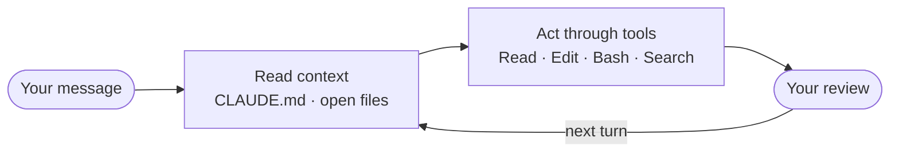
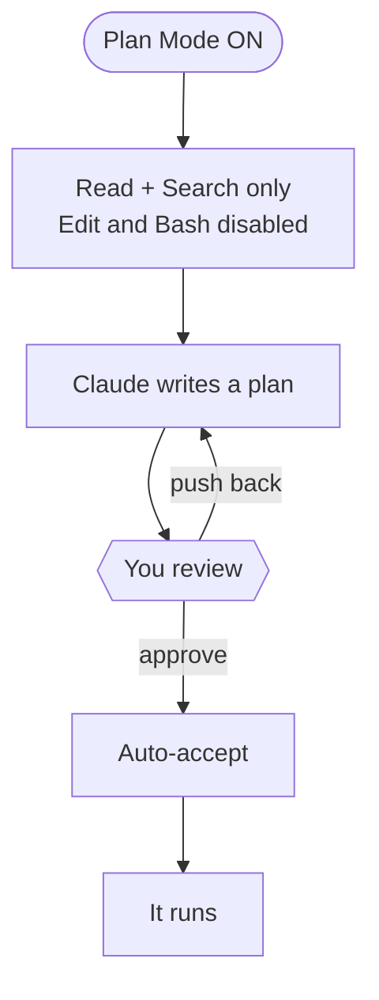

# How Claude Code Actually Works

*For anyone who wants the theory behind what they are being asked to do.*

---

## The loop

Claude Code is not a chatbot with a terminal attached. It runs a loop, and the loop is the product.

Each turn:

1. **It reads context.** Your message, `CLAUDE.md`, and any file it has opened. This happens on *every* turn, not once at the start.
2. **It acts through tools.** Read a file, edit a file, run a command, search a folder. You see each call before it executes.
3. **It stops for you.** Then round again.

**The implication people miss:** you steer it by editing files, not by arguing in chat. A line in `CLAUDE.md` saying *"group tickets by meaning, never by language"* does more work than a paragraph of explanation in a prompt, because it gets re-read every turn while your explanation scrolls out of memory.

### Plan Mode is enforcement, not etiquette

With Plan Mode on, the edit and command tools are switched off at the framework level. Claude cannot write a file even if it decides it should. It reads, searches, and produces a plan.

You read the plan, push back, then approve. Boris Cherny, who built Claude Code, describes his own workflow the same way: iterate in Plan Mode until the plan is right, then switch to auto-accept and let it run.

---

## The three claims

### 1. Do the work once, then keep it

Getting a good answer out of an AI stopped being the hard part some time ago. Getting the same answer next quarter, without re-explaining yourself, is where the actual leverage sits.

A **Skill** is how that survives. A folder with a `SKILL.md` describing a job and how you want it done. Claude scans the first line of every Skill each session and loads the ones that match. You write it once.

The trick this workshop teaches is that you do not write it from a blank page. You do the job first, then ask Claude to write down what you both just did. Everything it needs is still in its context: the corrections you made, the conventions you insisted on, the order you worked in.

### 2. You cannot test your own instructions

You wrote them, so you read straight past the step that only makes sense if you remember the conversation. This is the same reason writers cannot proofread their own work.

A **subagent** solves it structurally. It is a separate session with its own context window, and it knows nothing about your conversation. Send it at your Skill and ask what it had to guess. The guesses are the sentences you did not write.

Notice what that is: a test harness. You did not build one, you asked for an isolated run and read the complaints.

### 3. Give it the reach the task needs

An agent confined to a folder can do a lot, and everything in this workshop happens inside one.

When a task genuinely needs to reach further, an **MCP server** grants one specific capability. A browser. A database. A ticketing system. One server, one reach.

The alternative on offer elsewhere is an agent with access to your whole machine. That is a real trade and worth making deliberately rather than by default. You can always see the boundary of what you granted, which matters more the more useful these things become.

---

## What a chat box structurally cannot do

Not a criticism of chat interfaces. They are the wrong shape for some jobs, and knowing which is the point.

### Work through a folder

A chat window takes one input at a time. You paste, it responds. There is no primitive for *"read all two hundred of these, including the ones that arrive next quarter."*

Claude Code runs as a process on your machine and can read, write and watch the filesystem. In this workshop that is the entire difference between beat 1 and beat 2.

### Remember anything

Close the tab and the work is gone. Next quarter you start from the first ticket, re-explaining the same conventions.

A `CLAUDE.md` and a `SKILL.md` are both just files on disk, which means they persist, they can be version controlled, and they can be handed to somebody else.

### Produce the artifact

Whatever a chat tells you, you copy back out by hand into a document you make yourself. You remain the integration layer.

Claude Code writes the file. That sounds small until you have done it both ways in the same morning.

---

## A useful way to hold it

Think of Claude Code as a capable colleague who started this morning. No context about your work, no knowledge of your preferences, no idea what "done" means here.

Given a clear brief written down where they can re-read it, they do exceptional work. Given a vague wish, they make reasonable guesses that compound into something you did not want.

So:

- **Brief it in a file**, once, rather than in every prompt.
- **Read the plan** before approving it. That is the habit, not approving.
- **Correct through files**, not arguments.
- **Have something check the result** that was not present when you did the work.

---

## Where to go deeper

Anthropic Academy publishes free courses on [Agent Skills](https://anthropic.skilljar.com/), subagents, and MCP. They cover the features thoroughly.

What they do not cover, and what this workshop is for, is the move in the middle: you did the work once, now make it repeatable, and find out whether it actually is.

[← Back to home](index.html)
