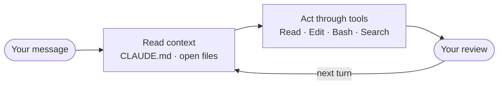

# Start Here — the three-minute version

*Read this while you are getting set up.*

---

## What you are doing today

You are the support lead at Nussaa, a food delivery app in Riyadh. Someone has handed you a quarter of customer complaints and asked what the themes were.

Two hundred tickets. Arabic, English, and both at once. Some useless, some duplicated. Your job is a report that says what went wrong and how often.

You will not write code. You will direct an agent, read what it proposes, correct it through files, and check the result.

Then you will do the part almost nobody teaches: **turn that whole workflow into a Skill, so next quarter takes ten minutes instead of a morning.**

> By the end you can take a folder of messy real work, direct Claude Code to research, analyse and produce a finished artifact from it, then turn that workflow into something that repeats. And you can prove it works, because you tested it in a clean context.

---

## The one mental model that matters

Claude Code is not a chat box in a terminal. It is a loop:



The part people miss is the first box. Claude re-reads your context files **on every single turn**, not just at the start.

That has one practical consequence, and it is the thing to carry into the next three hours:

> **You steer it by editing files, not by arguing in chat.**

A correction you type into the conversation dies with the session. The same correction written into `CLAUDE.md` gets read every turn, forever. When it does the wrong thing today, your first instinct should be *which file is wrong?* rather than *how do I re-word this?*

---

## Plan Mode, in one line

Press **Shift + Tab twice**. The footer says `plan mode on`. Claude now cannot edit a file or run a command, because the tools are switched off. All it can do is read, search, and write you a plan.

You read the plan and push back before approving. Catching a mistake in a plan costs a sentence.

---

## The three claims we are testing

You will watch each one happen rather than take it on trust.

1. **Do the work once, then keep it.** Getting a good answer out of an AI is not the hard part any more. Getting the same answer next quarter, without re-explaining yourself, is.
2. **You cannot test your own instructions.** You were there when you wrote them, so you read straight past the step that only makes sense if you remember the conversation. Something with no memory has to try it.
3. **Give it the reach the task needs.** Some agents want your whole machine. You can hand one exactly the capability a job requires instead, and see the boundary.

---

## The four pieces you will meet

Easy to confuse, and the difference is simple:

- **Skill** — something you want the agent to know how to do.
- **Subagent** — something you delegate to a clean context.
- **MCP server** — a specific capability you choose to grant.
- **Plugin** — those bundled, so a teammate installs them in one command.

Nobody writes a framework today. You compose these four, and test the result by asking for an isolated run.

---

## Before we start, check two things

```bash
claude --version     # prints a version number
claude doctor        # green
```

Red? Say so now, not at minute forty.

[← Back to home](index.html)
