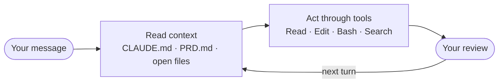

# Start Here — the three-minute version

*Read this while you're getting set up. If you already read [How Claude Code Actually Works](how-claude-code-works.md), you know all of it — go get coffee.*

---

## What you're building today

A command-line tool called `receipts`. It reads a folder of receipt files, pulls out the date, vendor, amount and category, stores them in a small database without ever double-counting the same receipt, and prints a spending report for any month.

You will not type the code. You'll write the spec, read the plan, approve it, and check the result.

**By the end you can take a blank folder and a one-page spec, and direct Claude Code to build, plan, and verify a working tool — and you'll know it's right because a test says so.**

---

## The one mental model that matters

Claude Code is not a chat box in a terminal. It's a loop:



The part people miss is the first box. Claude re-reads your context files **on every single turn** — not just at the start.

That has one very practical consequence, and it's the thing to carry into the next three hours:

> **You steer it by editing files, not by arguing in chat.**

A correction you type into the conversation is forgotten by the next message. The same correction written into `CLAUDE.md` is read every turn, forever. When Claude does the wrong thing today, your first instinct should be *"which file is wrong?"* — not *"how do I re-word this?"*

---

## Plan Mode, in one line

Press **Shift + Tab twice**. The footer says `plan mode on`. Now Claude *physically cannot* edit a file or run a command — the tools are switched off — so all it can do is read, search, and write you a plan.

You read the plan. You push back on anything wrong. Then you approve. Catching a mistake in a plan costs a sentence; catching it after 200 lines of code costs an afternoon.

---

## The three claims we're testing today

Not asserted — you'll watch each one happen.

1. **Structured intent beats clever prompting.** The model fills every gap you leave with a guess. A one-page spec fills the gaps before the first line of code. Same model, same task, wildly different result.
2. **Verification is what makes it real.** Anyone can get an AI to produce something that runs once. The difference between a demo and a tool is that a tool tells you when it's broken.
3. **It's a collaborator, not a genie.** It needs a brief and a feedback loop. Give it both and it's remarkable; give it neither and you get exactly what a chat tab gives you.

---

## Before we start, check two things

```bash
claude --version     # should print a version number
claude doctor        # should be green
```

Red? Say so now, not at minute forty.

[← Back to home](index.html)
